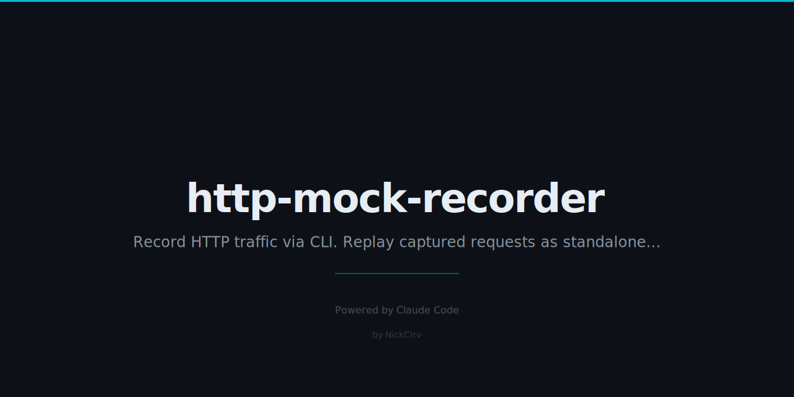

# http-mock-recorder

> Record real HTTP traffic. Replay it as mocks. Zero dependencies.

No config files. No external packages. Just Node.js builtins.
Run a proxy, make real API calls, get fixture files — then replay them in CI, tests, or offline environments.

## Install

```bash
npx http-mock-recorder [command]
# or install globally
npm install -g http-mock-recorder
```

Requires **Node.js 18+**

## Quick Start

```
┌─────────────────────────────────────────────────────────────────┐
│  STEP 1 — Record                                                │
│                                                                 │
│  $ hmr record --port 8080 --output ./fixtures                  │
│  ✓ Proxy running at http://localhost:8080                       │
│                                                                 │
│  $ HTTP_PROXY=http://localhost:8080 curl http://api.example.com │
│  ● GET     200  http://api.example.com/data                     │
│  ● POST    201  http://api.example.com/users                    │
│                                                                 │
│  STEP 2 — Inspect                                               │
│                                                                 │
│  $ hmr list --fixtures ./fixtures                               │
│  METHOD    STATUS   SIZE      RECORDED AT             URL       │
│  GET       200      1.2kb     3/3/2026, 14:02:11 PM  /data     │
│  POST      201      0.4kb     3/3/2026, 14:02:15 PM  /users    │
│                                                                 │
│  STEP 3 — Replay                                                │
│                                                                 │
│  $ hmr replay --port 8080 --fixtures ./fixtures                 │
│  ✓ Mock server running at http://localhost:8080                 │
│  ✓ GET     200  http://api.example.com/data (hit)              │
└─────────────────────────────────────────────────────────────────┘
```

## Commands

| Command | Description |
|---------|-------------|
| `hmr record` | Start a proxy on `--port` that records all traffic to `--output` |
| `hmr replay` | Start a mock server that replays fixtures from `--fixtures` |
| `hmr list` | Print a table of all recorded fixtures |
| `hmr clear` | Delete all fixture files from `--fixtures` directory |

## Options

| Flag | Default | Description |
|------|---------|-------------|
| `--port <n>` | `8080` | Port to listen on |
| `--output <dir>` | `./fixtures` | Directory to save recorded fixtures (record mode) |
| `--fixtures <dir>` | `./fixtures` | Directory to read fixtures from (replay/list/clear) |
| `--ignore-query` | off | Ignore query string when matching URLs in replay mode |
| `--format json` | off | Machine-readable JSON output on stdout |
| `--verbose` | off | Show extra log output (e.g. fixture filenames as saved) |
| `--help` | | Show help |

## Fixture Format

Each recorded request/response is saved as a JSON file:

```
fixtures/
  get-a3f91bc240-1709123456789.json
  post-b7d2e44f01-1709123461234.json
```

File naming: `{method}-{urlhash}-{timestamp}.json`

```json
{
  "id": "550e8400-e29b-41d4-a716-446655440000",
  "recorded_at": "2026-03-03T14:02:11.123Z",
  "request": {
    "method": "GET",
    "url": "http://api.example.com/data",
    "headers": { "accept": "application/json" },
    "body": null
  },
  "response": {
    "status": 200,
    "headers": { "content-type": "application/json" },
    "body": "{\"items\": []}"
  }
}
```

Sensitive headers (`authorization`, `x-api-key`, `cookie`, etc.) are automatically redacted to `[REDACTED]` before saving.

## HTTPS Support

HTTPS traffic is tunnelled via HTTP CONNECT. When using cURL or similar tools:

```bash
# Both HTTP and HTTPS traffic are captured
HTTPS_PROXY=http://localhost:8080 curl https://api.example.com/endpoint
```

Note: HTTPS body content passes through encrypted — only the tunnel metadata is logged in CONNECT mode. To capture HTTPS request/response bodies, configure your client to send unencrypted HTTP to the proxy (where your client handles TLS termination).

## Machine-Readable Output

Use `--format json` for scripting and CI integration:

```bash
hmr list --fixtures ./fixtures --format json | jq '.fixtures | length'

hmr replay --port 8080 --fixtures ./fixtures --format json \
  | while read line; do echo "Event: $line"; done
```

## Use in Tests

Point your HTTP client at the replay server in your test setup:

```js
// Jest / Vitest setup
import { execFile } from 'child_process';

let replayProcess;

beforeAll(async () => {
  replayProcess = execFile('hmr', ['replay', '--port', '9090', '--fixtures', './fixtures']);
  await new Promise(r => setTimeout(r, 300)); // wait for server to start
});

afterAll(() => replayProcess.kill());

test('fetches users', async () => {
  const res = await fetch('http://localhost:9090/users');
  expect(res.status).toBe(200);
});
```

## Why?

Integration tests that hit real APIs are slow, flaky, and break in CI. But hand-writing mock JSON is tedious and drifts from production reality. `http-mock-recorder` captures real traffic once — so your mocks always reflect the actual API, with zero extra dependencies in your project.

---

Built with Node.js · Zero dependencies · MIT License
